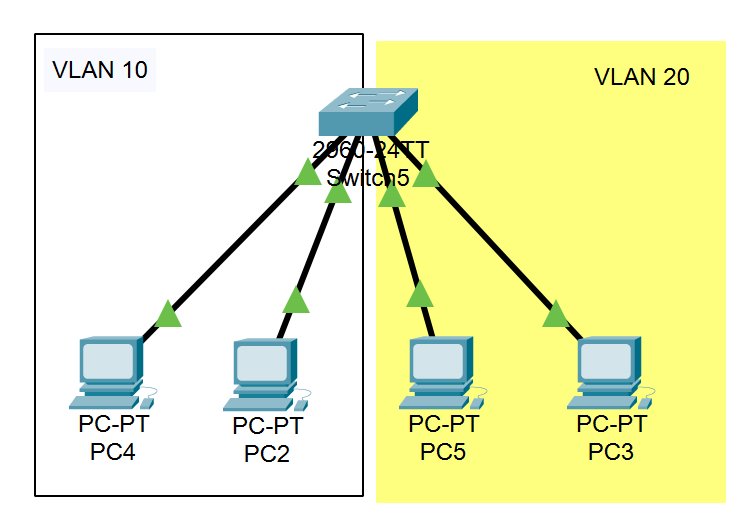
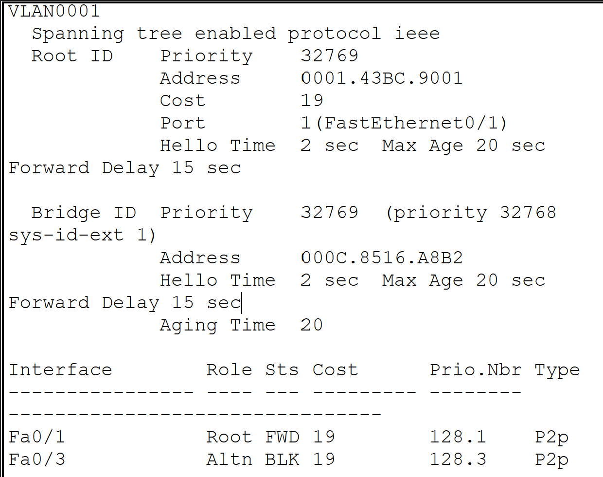

## L2Switch-1 
- 2台のPC間にL2スイッチを接続しPC同士で通信できるようにしましょう。 

### Packet Tracerの設置
Packet Tracer上にPCを2台配置し、2960-24TTのL2スイッチを1台配置。接続後、各PCへIPアドレスを設定。
PC0: 192.168.1.10
PC1: 192.168.1.20
サブネットマスク：255.255.255.0

### スイッチの状態確認
接続ポートのリンクランプが緑色であることを確認し、物理接続が正常に行われていることを確認。
Cisco IOSへログイン。
- show ip interface brief
を使用してインターフェース状態を確認。

### ping確認
PC0のCommand Promptを開く。
- ping 192.168.1.20
PC0 → PC1に
- Reply from 192.168.1.20 が表示(=成功)

## L2Switch-2 
### 4台のPCを1つのL2スイッチに接続しvlanを作成します。PC01はPC02と、PC03はPC04とだけ接続できるように設定しましょう。 

                 [ L2 Switch ]

      VLAN10                    VLAN20
 ┌────────────────┐      ┌────────────────┐
 │                │      │                │
 │ Fa0/1 ─ PC01   │      │ Fa0/3 ─ PC03   │
 │ Fa0/2 ─ PC02   │      │ Fa0/4 ─ PC04   │
 │                │      │                │
 └────────────────┘      └────────────────┘

 ### VLAN作成
- switchを右クリック。CUIでVLAN作成。
- VLAN 10を作成
sw01> enable 
sw01# configure terminal 
sw01(config)#vlan 10 
sw01(config-vlan)# 
sw01(config)#interface fastEthernet 0/1 
sw01(config-if)#switchport mode access 
sw01(config-if)#switchport access vlan 10

sw01> enable 
sw01# configure terminal 
sw01(config)#vlan 10 
sw01(config-vlan)#  
sw01(config)#interface fastEthernet 0/2
sw01(config-if)#switchport mode access 
sw01(config-if)#switchport access vlan 10

- VLAN 20を作成
sw01> enable 
sw01# configure terminal 
sw01(config)#vlan 20 
sw01(config-vlan)# 
sw01(config)#interface fastEthernet 0/3
sw01(config-if)#switchport mode access 
sw01(config-if)#switchport access vlan 20

sw01> enable 
sw01# configure terminal 
sw01(config)#vlan 20
sw01(config-vlan)# 
sw01(config)#interface fastEthernet 0/4
sw01(config-if)#switchport mode access 
sw01(config-if)#switchport access vlan 20

### 確認
show vlan briefコマンドを使用して、各ポートが正しいVLANへ所属していることを確認。

### 各PCへIPアドレスを設定
PCをクリックしDesktop → IP Configuration → IP入力。
VLAN10
PC01: 192.168.10.1
PC02: 192.168.10.2
Subnet Mask: どちらも255.255.255.0

VLAN20
PC03: 192.168.20.1
PC04: 192.168.20.2
Subnet Mask: どちらも255.255.255.0

Desktop → Command Promptからpingを実行。
- ping 192.168.10.2
成功 →　Reply from 192.168.10.2

## L2Switch-3 
3台のL2スイッチを環状に接続します。ループを検知し、ブロックするように設定されてい
ることを確認しましょう。設定されていたらルートブリッジを変更してみましょう。(STP（スパニングツリープロトコル）の確認)
### Packet Tracerの設定 
            [Switch6]
             /     \
            /       \
           /         \
   [Switch7] ------- [Switch8]

- switch>enable
- switch#show spanning-tree
### 出力結果

→ STPがループを検知してポートBlockingしている状態

### ルートブリッジの変更
※ルートブリッジ: STPではどのスイッチを基準（Root）にするか決めており、その基準スイッチのこと。
### 変更方法
- Rootにしたいスイッチで設定
### STP確認手順
①各スイッチへログインし、以下コマンドを実行した。
- show spanning-tree
②出力結果
Interface        Role Sts Cost Prio.Nbr Type
Fa0/1            Root FWD 19   128.1    P2p
Fa0/3            Altn BLK 19   128.3    P2p
→ Fa0/3がBlocking状態となっており、STPによってループ防止が正常に行われていることを確認。

### ルートブリッジ変更
- 今回はSwitch7をRoot Bridgeとして設定。
①特権モードへ移行
- enable
②グローバル設定モードへ移行
- configure terminal
③STP Priority変更
- spanning-tree vlan 1 priority 4096
### 設定内容
STPではPriority値が最も小さいスイッチがRoot Bridgeになる。
デフォルト値は32768であるため、4096へ変更することで当該スイッチがRoot Bridgeになりやすくなる。
### 確認手順
- 特権EXECモードへ戻り再度確認
- show spanning-tree
### 出力結果
- This bridge is the root
### 結果確認
- 上記表示より、設定したスイッチがRoot Bridgeへ変更されたことを確認

## 実施結果
- 3台のL2スイッチによるループ構成を作成
- STPによる自動ループ防止を確認
- Blockingポートが生成されることを確認
- Root Bridge変更を実施
STP経路再計算を確認